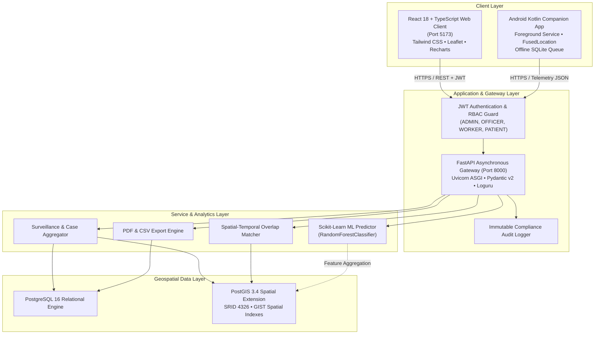

# HealthWatch — Intelligent Disease Surveillance & Outbreak Monitoring System

[](backend/)
[](frontend/)
[](database/)
[](mobile/)
[](backend/app/services/outbreak_predictor.py)
[](docker-compose.yml)
[-success.svg)](TEST_REPORT.md)

**HealthWatch** is an enterprise-grade, distributed public-health disease surveillance and outbreak monitoring platform developed for a Master of Computer Applications (MCA) academic project. 

The system enables health workers and public health authorities to manage communicable disease cases, visualize spatial disease distribution, monitor patient location telemetry under strict ethical consent, detect potential spatial-temporal exposures, identify geographic disease hotspots, generate epidemiological reports, and forecast outbreak risk using explainable machine learning.

---

## 📑 Documentation Quick Links

- 📘 **[Comprehensive Project Documentation (39 Chapters)](docs/PROJECT_DOCUMENTATION.md)**: Full academic project documentation covering problem statement, methodology, database design, ER diagrams, PostGIS spatial queries, algorithms, and limitations.
- 🏗️ **[Final Architecture Review](docs/FINAL_ARCHITECTURE_REVIEW.md)**: Complete technology stack audit, end-to-end communication flows, security posture, and readiness matrix.
- 🔒 **[Security & Privacy Audit Report](SECURITY_REVIEW.md)**: Cryptographic verification, RBAC privilege matrix, and patient data isolation proofs.
- 🧪 **[Complete Test Report (175/175 Passed)](TEST_REPORT.md)**: Automated backend test suite execution results across all 19 test modules.
- 🐧 **[WSL Ubuntu 24.04 Setup Guide](docs/WSL_SETUP.md)**: Step-by-step instructions for running on Windows Subsystem for Linux.

---

## 🏛️ System Architecture



---

## 🚀 Quick Start (Docker & WSL)

### 1. Prerequisites
- [Docker Desktop](https://www.docker.com/products/docker-desktop/) (with WSL2 engine enabled)
- Windows 10/11 or Ubuntu Linux / WSL2 Ubuntu 24.04 LTS

### 2. Launch All Services
```bash
# Clone and navigate to repository root
cd healthwatch

# Copy environment template
cp .env.example .env

# Launch Docker Compose stack
docker compose up --build -d
```

### 3. Service Access Endpoints
- 🌐 **Web Surveillance Portal**: [http://localhost:5173](http://localhost:5173)
- 🔌 **FastAPI Backend Gateway**: [http://localhost:8000](http://localhost:8000)
- 📖 **Interactive Swagger API Docs**: [http://localhost:8000/docs](http://localhost:8000/docs)
- 🩺 **System Health Telemetry**: [http://localhost:8000/api/health](http://localhost:8000/api/health)
- 🗄️ **PostgreSQL / PostGIS Database**: `localhost:5432`

---

## 🔑 Demonstration Accounts & Credentials

The database is pre-seeded with synthetic accounts across all 4 Role-Based Access Control (RBAC) tiers:

| Role | Email Address | Password | Permissions & Views |
| :--- | :--- | :--- | :--- |
| **ADMIN** | `admin@healthwatch.org` | `Admin@HealthWatch2026` | Full system control, user management, system configuration. |
| **PUBLIC_HEALTH_OFFICER** | `officer.surveillance@healthwatch.org` | `Officer@HealthWatch2026` | Surveillance dashboard, GIS, heatmap, exposure analysis, AI forecaster, reports. |
| **HEALTH_WORKER** | `worker.field01@healthwatch.org` | `Worker@HealthWatch2026` | Patient registration, case reporting, field tracking for assigned patients. |
| **PATIENT** | `patient.synth101@healthwatch.org` | `Patient@HealthWatch2026` | Self-service portal: My Dashboard, My Profile, My Monitoring, My Roadmap. |

*Note: In the web frontend, you can instantly toggle between **Patient View** and **Officer View** using the sidebar role switcher button.*

---

## 🛠️ Technology Stack Summary

| Layer | Component | Version | Purpose |
| :--- | :--- | :--- | :--- |
| **Frontend** | React, TypeScript, Vite | 18.3.1 / 5.4.5 / 5.2.13 | High-performance SPA with strict typing and modern glassmorphism design. |
| **Styling** | Tailwind CSS | 3.4.4 | Utility-first CSS with dark-mode defaults and medical HSL palette. |
| **Maps** | Leaflet, React-Leaflet | 1.9.4 / 4.2.1 | Geospatial mapping with custom zero-dependency HTML5 Canvas heatmap. |
| **Charts** | Recharts | 2.12.7 | Composable SVG time-series incidence and distribution charts. |
| **Backend** | FastAPI, Python | 0.111.0 / 3.11.16 | Asynchronous high-throughput REST API with Pydantic validation. |
| **ORM** | SQLAlchemy, GeoAlchemy2 | 2.0.30 / 0.15.1 | Declarative persistence with PostGIS geometry bindings. |
| **Database** | PostgreSQL + PostGIS | 16 / 3.4 | Relational engine with spatial indexing and geodetic meter calculations. |
| **Mobile** | Android (Kotlin) | SDK 34 / 1.9.22 | FusedLocationProvider Foreground Service with ~15-min sampling. |
| **AI / ML** | scikit-learn | 1.5.0 | Explainable Random Forest outbreak risk estimation. |
| **DevOps** | Docker Compose, WSL2 | v2 / Ubuntu 24.04 | Containerized multi-service deployment. |

---

## ⚠️ Important System Limitations

1. **Explicit Patient Authorization**: Location collection is strictly opt-in and requires affirmative, revocable patient consent.
2. **~15-Minute Periodic Sampling**: Location observations are captured approximately every 15 minutes, NOT via continuous second-by-second tracking.
3. **OS Background Throttling**: Mobile operating systems (Android Doze mode) may delay location callbacks during deep sleep or low-power states.
4. **Observation Roadmap Representation**: The movement roadmap displays discrete timestamped points; connecting lines illustrate sequence, NOT the exact physical path traveled.
5. **Non-Smartphone Patients**: Continuous GPS tracking is unavailable for patients without smartphones; health workers record approximate locations manually.
6. **Potential Exposure $\neq$ Transmission**: Proximity detection indicates spatial-temporal overlap, NOT medical transmission.
7. **Decision Support $\neq$ Medical Diagnosis**: AI risk forecasting is an epidemiological decision-support tool, NOT a diagnostic instrument.
8. **Synthetic Demonstration Data**: All patient names, phone numbers, and records are completely synthetic and fictitious.

---

## 🧪 Testing & Validation

Run the automated backend test suite (175 tests across 19 test modules):
```bash
# Execute test suite via Docker
docker exec -e PYTHONPATH=. healthwatch-backend pytest

# Verify frontend production build
docker exec healthwatch-frontend npm run build
```

---

## 📄 License & Academic Declaration

Developed as an academic Master of Computer Applications (MCA) capstone project.  
**HealthWatch Framework** &copy; 2026. All demonstration data is synthetic.
