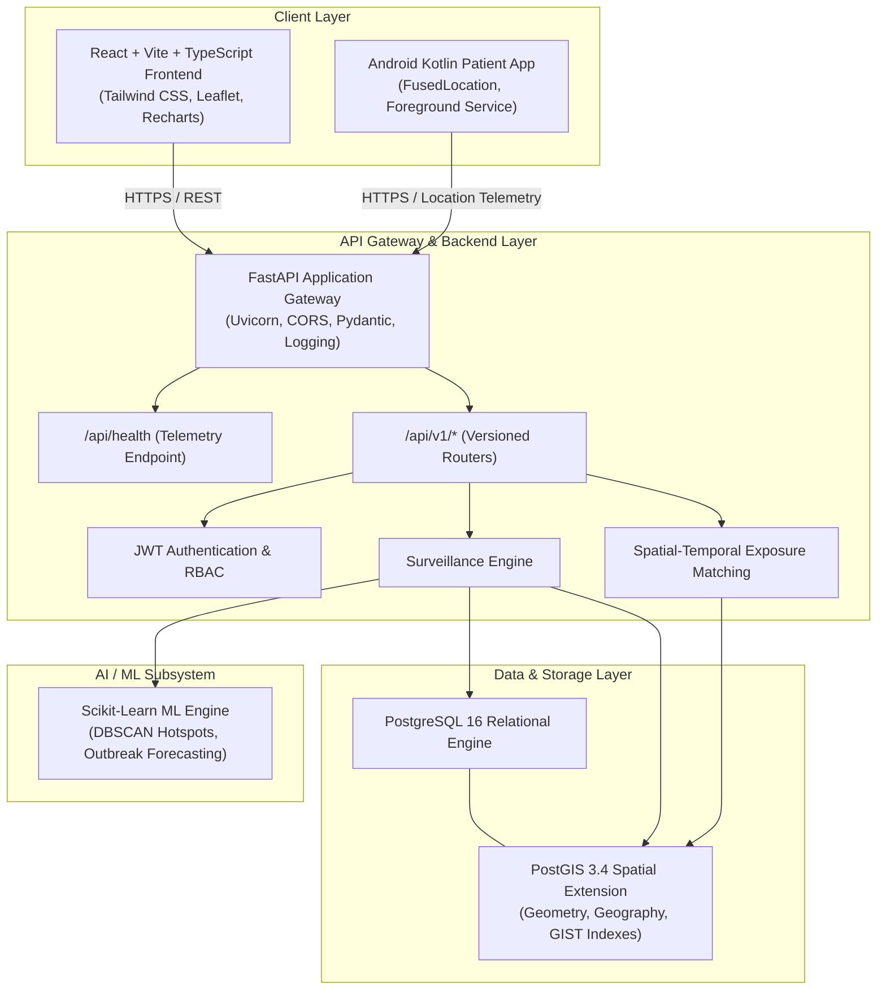

# HealthWatch — System Architecture & Design Specification

**HealthWatch** is an intelligent disease surveillance and outbreak monitoring platform developed as an MCA academic project. The system assists health workers and public health authorities in managing infectious disease cases, visualizing spatial disease distribution geographically, monitoring authorized patient locations, identifying potential spatial-temporal exposures, visualizing patient movement observations, detecting disease hotspots, generating epidemiological reports, and providing AI-assisted outbreak risk analysis.

---

## 1. High-Level System Architecture



---

## 2. Technology Stack

| Domain | Technology | Purpose & Justification |
| :--- | :--- | :--- |
| **Frontend UI** | **React 18, TypeScript, Vite** | High-performance, strictly typed component architecture with rapid HMR. |
| **Styling & Theme** | **Tailwind CSS** | Atomic, utility-first design system with dark-mode and custom medical palette. |
| **GIS Mapping** | **Leaflet, React-Leaflet** | Interactive geospatial visualization for patient trails, clusters, and geofences. |
| **Data Analytics** | **Recharts** | Composable SVG time-series charts for epidemiological trends. |
| **Backend API** | **Python 3.11, FastAPI** | Asynchronous, type-annotated, high-throughput REST API framework. |
| **ORM & Migrations** | **SQLAlchemy 2.0, Alembic** | Robust data persistence, declarative mapping, and schema version control. |
| **Spatial Engine** | **PostgreSQL 16 + PostGIS 3.4** | Spatial queries (`ST_DWithin`, `ST_Contains`, `ST_Distance`) and geospatial indexing. |
| **Spatial Python** | **GeoAlchemy2, Shapely** | Python native bindings and ORM integration for PostGIS geometries. |
| **AI / ML** | **Scikit-Learn, NumPy, Pandas** | DBSCAN spatial clustering and time-series outbreak regression. |
| **Patient Mobile** | **Android, Kotlin** | Foreground service location monitoring with Android Location APIs. |
| **Containerization** | **Docker & Docker Compose** | Reproducible multi-container runtime optimized for WSL Ubuntu 24.04. |

---

## 3. High-Level Directory Structure

```
healthwatch/
├── frontend/                  # React + TypeScript + Vite web client
│   ├── public/                # Static assets
│   ├── src/
│   │   ├── components/        # Layout, Dashboard, and Map components
│   │   ├── services/          # API communication client
│   │   ├── types/             # TypeScript definitions & health schemas
│   │   ├── App.tsx            # Main application shell
│   │   ├── index.css          # Tailwind CSS and glassmorphism styling
│   │   └── main.tsx           # React entry point
│   ├── index.html
│   ├── package.json
│   ├── tailwind.config.js
│   ├── tsconfig.json
│   ├── vite.config.ts
│   └── Dockerfile
│
├── backend/                   # FastAPI application
│   ├── alembic/               # Database migration scripts
│   ├── app/
│   │   ├── api/               # API routes (health, v1 router)
│   │   ├── core/              # Config, structured logging, custom exceptions
│   │   ├── db/                # SQLAlchemy session & Base model
│   │   ├── models/            # SQLAlchemy database models
│   │   ├── schemas/           # Pydantic schemas (Health, Auth, Cases)
│   │   └── main.py            # FastAPI application factory & lifespan
│   ├── requirements.txt
│   ├── alembic.ini
│   └── Dockerfile
│
├── mobile/                    # Android Kotlin patient companion app
│   ├── app/src/main/
│   │   ├── AndroidManifest.xml
│   │   └── java/com/healthwatch/
│   │       ├── MainActivity.kt
│   │       └── service/LocationMonitoringService.kt
│   └── build.gradle.kts
│
├── database/                  # PostgreSQL + PostGIS initialization
│   ├── init/
│   │   └── 01_init_postgis.sql
│   └── README.md
│
├── ai/                        # Outbreak prediction & clustering pipelines
│   ├── pipelines/
│   ├── requirements.txt
│   └── README.md
│
├── docker/                    # Docker build contexts
│   ├── Dockerfile.backend
│   ├── Dockerfile.frontend
│   └── README.md
│
├── docs/                      # Technical documentation & guides
│   ├── ARCHITECTURE.md
│   └── WSL_SETUP.md
│
├── tests/                     # Automated backend & frontend test suites
│   └── backend/
│       └── test_health.py
│
├── docker-compose.yml         # Container orchestration
├── .env.example               # Environment template
├── .gitignore                 # VCS ignore definitions
└── README.md                  # Project overview & quick start
```

---

## 4. Subsystem Details

### 4.1 How Frontend Works
- **Build Engine**: Vite bundles React 18 with TypeScript strict typing and Hot Module Replacement (HMR).
- **Theme & Layout**: Responsive glassmorphism interface styled via Tailwind CSS, featuring an interactive header, collapsable navigation sidebar, real-time telemetry badge, and modular content views.
- **Geospatial & Visualizations**: The interface provides dedicated containers for Leaflet GIS maps and Recharts outbreak analytics.
- **Backend Communication**: Centralized `apiClient` (`axios`) with automatic error fallback, polling `/api/health` to monitor backend connectivity and database health.

### 4.2 How Backend Works
- **Application Factory**: Configured in `backend/app/main.py` with custom lifespan management, CORS security headers, and structured logging.
- **Configuration**: Pydantic `BaseSettings` (`backend/app/core/config.py`) loads environment variables from `.env` with validation.
- **API Routing**:
  - `GET /api/health`: Top-level endpoint returning server timestamp, environment, and PostGIS database connection telemetry.
  - `/api/v1/*`: Modular versioned router prefix for domain endpoints (auth, cases, exposure, hotspots).
- **Error Handling**: Centralized exception handlers for `HealthWatchException`, `RequestValidationError`, and unexpected exceptions return uniform JSON envelopes.
- **Logging**: Configured via Loguru with standard library logging interception for unified console output.

### 4.3 How Database Works
- **Database Engine**: PostgreSQL 16 image bundled with PostGIS 3.4.
- **Initialization**: Automatically enables `postgis`, `postgis_topology`, and `uuid-ossp` extensions via `database/init/01_init_postgis.sql`.
- **ORM & Sessions**: Synchronous SQLAlchemy 2.0 engine with connection pooling and `get_db` generator dependency.
- **Migrations**: Alembic is initialized and pre-configured to detect spatial geometry columns.

### 4.4 How Docker Works
- **Orchestration**: `docker-compose.yml` defines three interdependent services on an isolated bridge network (`healthwatch-net`):
  1. `db`: PostGIS database with healthcheck (`pg_isready`).
  2. `backend`: FastAPI service waiting on `db` healthy condition.
  3. `frontend`: React Vite development server waiting on `backend` healthy condition.
- **Volume Mounts**: Source directories are mounted to enable live development and code reloading within containers.

---

## 5. WSL (Ubuntu 24.04) Development Workflow

The development environment is configured for **WSL Ubuntu 24.04** on Windows:
- Windows Path: `C:\Users\Alana P J\.gemini\antigravity-ide\scratch\healthwatch`
- WSL Path: `/mnt/c/Users/Alana P J/.gemini/antigravity-ide/scratch/healthwatch`

### Quick Start via WSL Terminal:
```bash
# 1. Navigate to project in WSL
cd "/mnt/c/Users/Alana P J/.gemini/antigravity-ide/scratch/healthwatch"

# 2. Copy environment variables
cp .env.example .env

# 3. Launch Docker Compose stack
docker compose up --build
```
