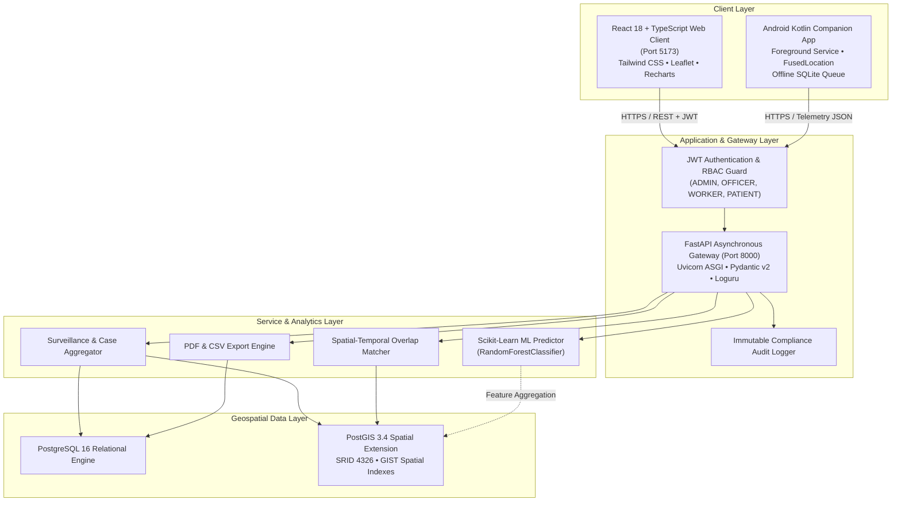
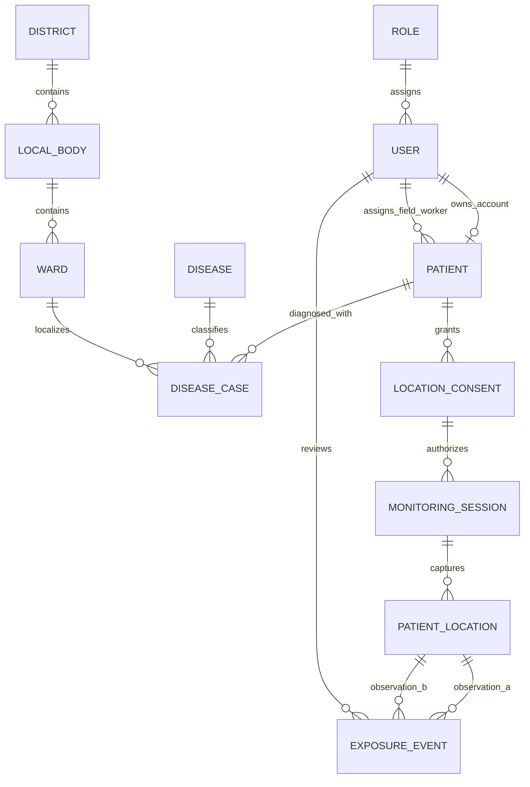

# HealthWatch — Intelligent Disease Surveillance & Outbreak Monitoring System

**Academic Degree:** Master of Computer Applications (MCA)  
**Project Category:** Geospatial Health Informatics, AI/ML & Distributed Systems  
**Platform Architecture:** React + TypeScript, FastAPI, PostgreSQL/PostGIS, Android (Kotlin), Docker  
**Documentation Version:** 1.0.0 (Final Comprehensive Project Documentation)  
**Date:** September 2026  

---

## Table of Contents

1. [Introduction](#1-introduction)
2. [Problem Statement](#2-problem-statement)
3. [Motivation](#3-motivation)
4. [Objectives](#4-objectives)
5. [Existing System](#5-existing-system)
6. [Proposed System](#6-proposed-system)
7. [Scope](#7-scope)
8. [System Architecture](#8-system-architecture)
9. [Technology Stack](#9-technology-stack)
10. [System Modules](#10-system-modules)
11. [Database Design](#11-database-design)
12. [Entity-Relationship (ER) Diagram Description](#12-entity-relationship-er-diagram-description)
13. [Authentication System](#13-authentication-system)
14. [Role-Based Access Control (RBAC)](#14-role-based-access-control-rbac)
15. [Patient Management Module](#15-patient-management-module)
16. [Disease Management Module](#16-disease-management-module)
17. [Disease Case Management Module](#17-disease-case-management-module)
18. [Geographic Information System (GIS)](#18-geographic-information-system-gis)
19. [PostgreSQL + PostGIS Spatial Engine](#19-postgresql--postgis-spatial-engine)
20. [Kerala Administrative Hierarchy (District / Local Body / Ward)](#20-kerala-administrative-hierarchy-district--local-body--ward)
21. [Patient Location Consent Architecture](#21-patient-location-consent-architecture)
22. [Authorized Monitoring Sessions](#22-authorized-monitoring-sessions)
23. [Android Location Collection Subsystem](#23-android-location-collection-subsystem)
24. [Approximately 15-Minute Sampling Interval Policy](#24-approximately-15-minute-sampling-interval-policy)
25. [Patient Location History Telemetry](#25-patient-location-history-telemetry)
26. [Patient Movement Roadmap Visualization](#26-patient-movement-roadmap-visualization)
27. [Disease Hotspot Heatmap Engine](#27-disease-hotspot-heatmap-engine)
28. [Spatial-Temporal Exposure Analysis](#28-spatial-temporal-exposure-analysis)
29. [Public Health Surveillance Dashboard](#29-public-health-surveillance-dashboard)
30. [Surveillance Reporting & Data Export Subsystem](#30-surveillance-reporting--data-export-subsystem)
31. [AI-Assisted Outbreak Risk Prediction](#31-ai-assisted-outbreak-risk-prediction)
32. [Containerization & Docker Orchestration](#32-containerization--docker-orchestration)
33. [WSL Ubuntu 24.04 LTS Development Environment](#33-wsl-ubuntu-2404-lts-development-environment)
34. [REST API Architecture & Endpoints](#34-rest-api-architecture--endpoints)
35. [System Security Posture](#35-system-security-posture)
36. [Patient Privacy Framework](#36-patient-privacy-framework)
37. [Verification & Testing Strategy](#37-verification--testing-strategy)
38. [Important System Limitations](#38-important-system-limitations)
39. [Future Enhancements](#39-future-enhancements)

---

## 1. Introduction

**HealthWatch** is an enterprise-grade, distributed public-health surveillance and epidemiological decision-support platform designed to monitor communicable and non-communicable disease incidents, evaluate geographic hotspot clustering, trace potential spatial-temporal disease overlap, and predict outbreak risks across administrative boundaries.

Built using an asynchronous micro-service inspired architecture, HealthWatch bridges the gap between field healthcare workers, patients under quarantine/observation, and public health command authorities. The platform couples high-precision PostGIS geospatial indexing with explainable machine learning models to transform raw point observations into actionable public-health intelligence while strictly adhering to ethical privacy safeguards.

---

## 2. Problem Statement

Traditional infectious disease surveillance and outbreak monitoring frameworks in municipal and state health administrations suffer from critical architectural and operational bottlenecks:
1. **Siloed & Delayed Data Entry**: Case reporting relies heavily on manual paperwork or legacy batch uploads, introducing latency of days or weeks before state epidemiologists detect localized transmission spikes.
2. **Lack of Native Geospatial Intelligence**: Standard relational databases record spatial data as flat text strings (e.g., street address or postal code) without geometric coordinates, preventing real-time proximity matching, polygon boundary containment, and density heat mapping.
3. **Crude or Intrusive Location Tracking**: Many surveillance apps during global epidemics resorted to continuous second-by-second battery-draining GPS tracking without clear consent management, causing severe battery depletion, device OS termination, and civil privacy concerns.
4. **Absence of Spatial-Temporal Overlap Detection**: Health authorities lack automated tools to compute whether two patients were in proximity at overlapping times, relying instead on subjective, memory-based patient interviews.
5. **Opaque Black-Box AI Models**: Modern deep learning models rarely provide explainable justifications to medical officers, generating high false-alarm rates without actionable feature attribution.

---

## 3. Motivation

The motivation behind HealthWatch is to develop a mathematically grounded, ethically sound, and technologically modern surveillance platform tailored for complex administrative geographies such as the state of Kerala, India.

By incorporating PostGIS geodetic spatial calculations, a strict patient consent lifecycle, periodic ~15-minute sampling intervals, and explainable scikit-learn random forest models, HealthWatch demonstrates how contemporary software engineering can elevate public health surveillance without sacrificing patient civil liberties or device stability.

---

## 4. Objectives

The primary technical and functional objectives of the HealthWatch platform are:
1. **Unified Spatial Surveillance**: Model state administrative hierarchies (Districts, Local Bodies/Municipal Corporations, and Wards) as native PostGIS multipolygons.
2. **Ethical Patient Location Telemetry**: Implement an Android application that records patient GPS observations at approximately 15-minute intervals only under active, patient-revocable consent.
3. **Discrete Movement Roadmaps**: Provide patient and health worker access to sequential, discrete observation pins without falsely claiming unrecorded continuous paths.
4. **Hotspot Density Aggregation**: Generate geographic case density heatmaps using self-contained HTML5 canvas layers to identify outbreak clusters without exposing individual residential coordinates.
5. **Spatial-Temporal Overlap Engine**: Detect candidate exposure events when two patients record observations within configurable distance ($\Delta d \le \text{threshold}$) and time ($\Delta t \le \text{threshold}$) limits.
6. **Decision-Support AI Outbreak Forecasting**: Train explainable Random Forest models on historical incidence velocity, spatial density, and $R_0$ transmission factors to forecast area risk tiers (`LOW`, `MEDIUM`, `HIGH`, `CRITICAL`).
7. **Strict Role-Based Access Isolation**: Prevent unauthorized access by isolating patient records from administrative tools through cryptographically signed JWT tokens.

---

## 5. Existing System

Traditional public-health monitoring mechanisms present several structural deficiencies:
- **Paper Registers and Periodic Excel Sheets**: Data is collated at primary health centers (PHCs) and forwarded upwards weekly, rendering real-time intervention impossible.
- **Continuous Second-by-Second Tracking**: Apps that sample coordinates every few seconds trigger Android OS Doze mode terminations, rapid battery drain, and intense user pushback.
- **Unverified Point Pinning**: Location data often lacks horizontal accuracy metrics, recording tower triangulation offsets as exact GPS fixes.
- **Manual Contact Tracing**: Epidemiologists reconstruct contact history manually through patient memory recall, leading to recall bias and missed community transmission events.

---

## 6. Proposed System

HealthWatch introduces a coordinated software architecture to solve these problems:
- **Micro-Interval Periodic Telemetry**: Operates at ~15-minute intervals, striking an optimal balance between epidemiological utility and mobile battery longevity.
- **PostGIS Native Geodesy**: Uses `GEOGRAPHY(POINT, 4326)` for calculations in physical meters and `GEOMETRY(MULTIPOLYGON, 4326)` for administrative containment.
- **Self-Contained Canvas Heatmaps**: Bypasses external unmaintained dependencies with native HTML5 Canvas radial blur kernels and color gradient ramps.
- **Auditable Exposure Detection**: Identifies potential spatial-temporal overlaps with explicit confidence scoring and public health disclaimers.
- **Explainable Decision Support**: ML forecasts include feature attribution percentages (recent case acceleration, $R_0$, density, overlap counts).

---

## 7. Scope

### In Scope:
- Web surveillance command center for public health officers and administrators.
- Field worker portal for registering patients, diagnoses, and manual observations.
- Patient mobile application (Android Kotlin) with foreground location service and offline synchronization.
- Geospatial mapping of Kerala districts (Thiruvananthapuram, Ernakulam, Kozhikode) down to urban wards.
- Automated report generation in PDF and CSV formats.
- Outbreak risk classification using calibrated scikit-learn models.

### Out of Scope:
- Direct hardware biosensor telemetry (e.g., continuous pulse oximetry or ECG feeds).
- Automated medical diagnosis or clinical prescription generation.
- Real-time global satellite imagery processing.

---

## 8. System Architecture

HealthWatch employs a multi-tier client-server architecture organized into presentation, application service, geospatial processing, and persistent database layers.



---

## 9. Technology Stack

### 9.1 Frontend Presentation Tier
- **Framework**: React 18.3.1
- **Language**: TypeScript 5.4.5 (Strict Mode enabled)
- **Bundler & Dev Server**: Vite 5.2.13 with Hot Module Replacement (HMR)
- **Styling**: Tailwind CSS 3.4.4 with custom glassmorphism, HSL medical palettes, and dark mode defaults
- **Mapping & Spatial Visualization**: Leaflet 1.9.4, React-Leaflet 4.2.1, Custom HTML5 Canvas Heatmap Layer
- **Epidemiological Charting**: Recharts 2.12.7 (SVG Area, Bar, and Pie components)
- **Iconography**: Lucide-React 0.395.0
- **HTTP Client**: Axios 1.7.2 with interceptors for token management

### 9.2 Backend Application Tier
- **Language**: Python 3.11.16
- **Framework**: FastAPI 0.111.0
- **ASGI Server**: Uvicorn 0.30.1
- **Data Validation & Schemas**: Pydantic v2.7.1
- **Database ORM**: SQLAlchemy 2.0.30 with connection pooling
- **Spatial ORM Extension**: GeoAlchemy2 0.15.1 and Shapely 2.0.4
- **Authentication**: Python-JOSE (JWT HS256), Passlib (Bcrypt password hashing)
- **Machine Learning**: scikit-learn 1.5.0, NumPy 1.26.4, Pandas 2.2.2
- **Logging**: Loguru 0.7.2 with structured JSON output and console colorization
- **Reporting**: ReportLab 4.2.0 for PDF generation

### 9.3 Database & Storage Tier
- **Relational Engine**: PostgreSQL 16
- **Spatial Extension**: PostGIS 3.4
- **Coordinate Reference System (CRS)**: WGS 84 (SRID 4326)
- **Indexing**: Generalized Search Tree (GIST) on all geometry and geography columns

### 9.4 Mobile Subsystem
- **Platform**: Android OS (API Level 26+ / Android 8.0 to Android 14)
- **Language**: Kotlin 1.9.22
- **Location Engine**: Google Play Services `FusedLocationProviderClient`
- **Background Execution**: Android Foreground Service with continuous Notification Channel
- **HTTP Client**: OkHttp 4.12.0 and Gson 2.10.1

### 9.5 Infrastructure & DevOps
- **Containerization**: Docker & Docker Compose v2
- **Host OS & Subsystem**: Windows 11 with WSL2 (Ubuntu 24.04.1 LTS)
- **Testing Framework**: Pytest 8.4.2 with HTTPX TestClient

---

## 10. System Modules

The platform is partitioned into 10 cohesive modules:

1. **Authentication & Access Control**: Issues and validates signed JWT tokens; guards role-specific routes.
2. **Patient Registry Management**: Records demographics, pseudo-identifiers, contact records, and field worker assignments.
3. **Disease Catalog**: Classifies infectious and non-communicable pathogens, contagion classes, incubation windows, and basic reproduction numbers ($R_0$).
4. **Disease Case Surveillance**: Tracks diagnosis dates, severity classifications, and spatial case coordinates.
5. **GIS Spatial Boundary Engine**: Manages Kerala districts, local bodies, and wards with GeoJSON serialization.
6. **Location Consent & Session Manager**: Oversees opt-in authorization, time-bounded monitoring sessions, and instant patient revocation.
7. **Patient Movement Roadmap**: Visualizes discrete observation sequences, temporal timelines, and polyline connections.
8. **Disease Hotspot Heatmap**: Aggregates spatial case density into heat layers and classified risk tiers (`HOTSPOT`, `HIGH`, `MODERATE`, `LOW`).
9. **Spatial-Temporal Exposure Matcher**: Detects proximity overlaps between patient paths within user-configured space and time thresholds.
10. **AI Outbreak Risk Forecaster**: Estimates multi-area outbreak probability and trajectory using Random Forest models.

---

## 11. Database Design

The PostgreSQL database maintains strict referential integrity, foreign key constraints, and spatial indexes across 11 core tables.

### Key Database Tables & Schemas:
- `users`: Core identity table (id, email, hashed_password, full_name, role_id, is_active, is_superuser, created_at).
- `roles`: Role definitions (`ADMIN`, `PUBLIC_HEALTH_OFFICER`, `HEALTH_WORKER`, `PATIENT`).
- `patients`: Patient demographic directory (id, pseudo_id, user_id, assigned_worker_id, full_name, age, gender, contact_number, address, district_name, local_body_name, ward_number, is_active).
- `diseases`: Pathogen catalog (id, code, name, contagion_type, category, incubation_period_days, r0_estimate, is_active).
- `disease_cases`: Diagnosis surveillance (id, patient_id, disease_id, ward_id, case_status, severity, diagnosis_date, recovery_date, latitude, longitude, location [Geography], source).
- `districts`: District multipolygons (id, code, name, state, center_latitude, center_longitude, boundary [Geometry]).
- `local_bodies`: Corporations/Municipalities (id, district_id, name, body_type, boundary [Geometry]).
- `wards`: Granular urban/rural wards (id, local_body_id, ward_number, name, center_latitude, center_longitude, boundary [Geometry]).
- `location_consents`: Ethical permissions (id, patient_id, consent_status, consent_version, monitoring_start, monitoring_end, revoked_at, purpose).
- `monitoring_sessions`: Active surveillance windows (id, patient_id, consent_id, start_time, end_time, status, stopped_at).
- `patient_locations`: Periodic GPS observations (id, patient_id, monitoring_session_id, latitude, longitude, accuracy, recorded_at, source, location_geography [Geography]).
- `exposure_events`: Proximity overlaps (id, patient_a_id, patient_b_id, observation_a_id, observation_b_id, distance, time_difference, confidence_score, status, review_notes).

---

## 12. Entity-Relationship (ER) Diagram Description



### Relational Dynamics:
- **One User to One Patient Profile**: When a user with the `PATIENT` role authenticates, their `user_id` maps strictly to their corresponding row in `patients`.
- **Hierarchical Spatial Inclusion**: Each `District` contains multiple `Local Bodies` (Municipalities/Panchayats), which in turn contain multiple `Wards`.
- **Consent-Guarded Sessions**: A `Monitoring Session` can only be initialized if backed by a valid, unexpired `Location Consent`.
- **Dual Observation Linking in Exposure**: An `Exposure Event` references two distinct `Patient Location` observation IDs along with their respective `Patient` IDs.

---

## 13. Authentication System

Authentication is built upon cryptographically signed **JSON Web Tokens (JWT)**:
- **Algorithm**: HMAC-SHA256 (HS256).
- **Password Hashing**: Bcrypt with adaptive salt generation.
- **Payload Claims**:
  - `sub`: Unique UUID string of the authenticated user.
  - `role`: Role string (`ADMIN`, `PUBLIC_HEALTH_OFFICER`, `HEALTH_WORKER`, `PATIENT`).
  - `email` & `full_name`: User identity metadata.
  - `exp`: Expiration timestamp (default: 480 minutes).
- **Protection Flow**: Clients transmit the token via the HTTP `Authorization: Bearer <TOKEN>` header. The backend dependency `get_current_user` extracts and decodes the token on every protected API call.

---

## 14. Role-Based Access Control (RBAC)

HealthWatch enforces strict Role-Based Access Control across 4 distinct tiers:

| Role Name | Scope & Authority | Allowed Actions & Endpoints |
| :--- | :--- | :--- |
| **ADMIN** | Full Platform Authority | All endpoints, system configuration, user provisioning, audit inspection. |
| **PUBLIC_HEALTH_OFFICER** | Epidemiological Command | Surveillance dashboard, GIS analysis, hotspot evaluation, exposure review, AI forecasting, reports. |
| **HEALTH_WORKER** | Field Operations | Patient registration, case diagnosis entry, field observation submission for assigned patients. |
| **PATIENT** | Self-Service Telemetry | Personal dashboard, consent granting/revocation, session controls, own location history & roadmap. |

> [!IMPORTANT]
> **Strict Patient Data Isolation**: Patients attempting to access records of other patients or administrative surveillance endpoints (`/api/v1/surveillance/*`, `/api/v1/exposure/*`) receive an immediate `HTTP 403 Forbidden` response.

---

## 15. Patient Management Module

The Patient Management module manages patient demographics while protecting confidentiality:
- **Pseudo-Identifiers**: Every patient is assigned a deterministic pseudo-ID (`PAT-SYNTH-101`) to anonymize clinical logs and maps.
- **Demographics Tracking**: Records full name, age, gender, contact phone number, and physical residential address.
- **Administrative Linkage**: Binds the patient to a specific Kerala District, Local Body, and Ward number.
- **Assigned Health Worker**: Links patients to a designated field worker who conducts home visits and verifies quarantine compliance.

---

## 16. Disease Management Module

The Disease Management module maintains the infectious disease catalog:
- **Pathogen Classification**: Tracks disease code, standardized clinical name, and vector category (Respiratory, Vector-Borne, Water-Borne, Metabolic).
- **Contagion Type**: Distinguishes between `CONTAGIOUS` pathogens (triggering spatial-temporal exposure analysis) and `NON_CONTAGIOUS` chronic conditions.
- **Epidemiological Constants**: Records average incubation period (days) and biological reproduction number ($R_0$).

---

## 17. Disease Case Management Module

Tracks clinical diagnoses and individual recovery trajectories:
- **Status Progression**: Cases transition through `SUSPECTED` &rarr; `CONFIRMED` &rarr; `RECOVERED` (or `DECEASED`).
- **Severity Rating**: Classifies illness severity into `MILD`, `MODERATE`, `SEVERE`, and `CRITICAL`.
- **Temporal Milestones**: Records formal diagnosis date and recovery date.
- **Spatial Localization**: Links the diagnosis to a specific ward polygon and coordinates (`latitude`, `longitude`).

---

## 18. Geographic Information System (GIS)

The GIS module provides comprehensive geospatial analysis:
- **Choropleth Visualizations**: Displays administrative district boundaries with color-coded case counts.
- **Point Clusters**: Plots discrete case coordinates with status color coding (Red = Confirmed, Yellow = Suspected, Green = Recovered).
- **Cascading Administrative Filters**: Filtering by District automatically updates Local Body options, which subsequently cascades down to Ward options.
- **Spatial Bounds Auto-Fitting**: The map automatically adjusts viewport bounds and zoom levels to encompass filtered case points.

---

## 19. PostgreSQL + PostGIS Spatial Engine

Geospatial data storage and calculations are powered by PostGIS 3.4:
- **Geometry vs Geography**:
  - `GEOMETRY(MULTIPOLYGON, 4326)`: Used for administrative boundaries where planar polygon intersection and containment tests (`ST_Contains`, `ST_Intersects`) are performed.
  - `GEOGRAPHY(POINT, 4326)`: Used for patient location observations and case points to execute spherical calculations directly in physical **meters** via `ST_DWithin` and `ST_Distance`.
- **Spatial Indexing**: All geometry and geography columns feature Generalized Search Tree (`GIST`) indexing, reducing spatial lookup time from $O(N)$ to $O(\log N)$.

---

## 20. Kerala Administrative Hierarchy (District / Local Body / Ward)

HealthWatch is pre-seeded with spatial hierarchies representing major districts of Kerala:
1. **Thiruvananthapuram (KL-TVM)**:
   - Thiruvananthapuram Municipal Corporation (Palayam Ward #1, Medical College Ward #2, Fort Ward #3, Pattom Ward #4).
   - Nedumangad Municipality (Town Ward #1, Valavur Ward #2).
2. **Ernakulam (KL-EKM)**:
   - Kochi Municipal Corporation (Marine Drive Ward #5, Edappally Ward #6).
3. **Kozhikode (KL-KKD)**:
   - Kozhikode Municipal Corporation (Mananchira Ward #7).

Every boundary is represented as a closed spatial polygon capable of determining whether a patient coordinate falls within an urban containment zone.

---

## 21. Patient Location Consent Architecture

HealthWatch enforces ethical location surveillance:
- **Explicit Opt-In**: Telemetry collection is disabled by default. A patient must affirmatively submit a signed consent request (`POST /api/v1/monitoring/consent/grant`).
- **Purpose Specification**: Every consent record states the legal and clinical purpose (e.g., "Authorized Quarantine Compliance & Outbreak Contact Surveillance").
- **Time-Bounded Validity**: Consents specify explicit `monitoring_start` and `monitoring_end` timestamps (typically 14 days).
- **Immediate Revocation**: Patients retain the right to revoke consent at any time via `POST /api/v1/monitoring/consent/revoke`. Revocation immediately invalidates all active monitoring sessions.

---

## 22. Authorized Monitoring Sessions

Surveillance occurs within structured, discrete monitoring sessions:
- **Session Lifespan**: Sessions can be started (`POST /api/v1/monitoring/sessions/start`) and stopped (`POST /api/v1/monitoring/sessions/stop`) by authorized patients.
- **State Machine**: Sessions transition between `ACTIVE`, `STOPPED`, and `EXPIRED`.
- **Pre-Condition Validation**: The backend checks:
  1. Does an active, unrevoked consent exist for this patient?
  2. Is the current timestamp within the consent duration window?
  If either condition fails, session initiation is rejected.

---

## 23. Android Location Collection Subsystem

Patient location telemetry is gathered via a dedicated Android companion application:
- **FusedLocationProviderClient**: Combines GPS, Wi-Fi, and cellular tower signals to acquire coordinates.
- **Foreground Service Architecture**: Operates as a persistent Foreground Service (`LocationMonitoringService.kt`) displaying an ongoing, non-dismissible notification in the device status bar.
- **Offline Resiliency**: In offline environments (e.g., lack of cellular coverage), coordinates are buffered into an encrypted local SQLite queue (`OfflineLocationQueue.kt`) and flushed to the backend upon network reconnection.

---

## 24. Approximately 15-Minute Sampling Interval Policy

Unlike turn-by-turn navigation applications that record coordinates every second, HealthWatch enforces a **~15-minute sampling interval policy**:
- **Constant Value**: `INTERVAL_MILLIS = 15 * 60 * 1000L` (900,000 milliseconds).
- **Epidemiological Justification**: Infectious disease transmission requires sustained proximity (typically 10–15 minutes). Second-by-second data introduces noise without epidemiological benefit.
- **Device Health & Battery Conservation**: ~15-minute intervals allow the mobile CPU to enter low-power sleep states, preventing device overheating, battery exhaustion, and background service termination by the Android OS.

---

## 25. Patient Location History Telemetry

Location history is exposed as an auditable, tabular registry:
- **Field Attributes**: Records Observation ID, Timestamp (UTC / Local), Latitude, Longitude, Horizontal Accuracy ($\pm \text{meters}$), and Source Provider.
- **Source Differentiation**: Distinguishes between `PATIENT_GPS` (direct device telemetry), `HEALTH_WORKER` (field observations), and `SIMULATED` (demonstration data).
- **Pagination & Sorting**: Paginated server-side to ensure responsive loading across thousands of historical records.

---

## 26. Patient Movement Roadmap Visualization

The movement roadmap translates discrete location observations into visual decision support:
- **Sequential Observation Markers**: Markers labeled alphabetically ($A, B, C, \dots$) represent chronological observations.
- **Color Coding**: Distinct markers denote Route Origin (Green), Intermediate Observations (Cyan), and Route Destination (Red).
- **Polyline Visualizer**: Draws a dashed connecting line between sequential coordinates.

> [!WARNING]
> **Observation vs. Path Trajectory**: The polyline connecting observations represents visual continuity between discrete points. It does **NOT** prove that the patient followed that specific physical trajectory between timestamps.

---

## 27. Disease Hotspot Heatmap Engine

The Disease Hotspot Heatmap visualizes geographic case density across municipal jurisdictions:
- **Density Accumulation**: PostGIS aggregates active cases within localized spatial bounds.
- **Self-Contained Canvas Layer**: Renders an HTML5 Canvas overlay with radial shadow-blurred circular kernels per observation coordinate, colorized via a linear gradient:
  - `0.2` &rarr; Blue (Low concentration)
  - `0.4` &rarr; Cyan (Low-to-Moderate concentration)
  - `0.6` &rarr; Yellow (Moderate concentration)
  - `0.8` &rarr; Orange (High concentration)
  - `1.0` &rarr; Crimson Red (Hotspot cluster)
- **Risk Tier Rings**: Highlights high-density areas with pulsing risk tier rings (`HOTSPOT`, `HIGH`, `MODERATE`, `LOW`).

---

## 28. Spatial-Temporal Exposure Analysis

The Spatial-Temporal Exposure engine identifies potential overlaps between two patients:

### Exposure Detection Algorithm:
Given Patient $A$ at $(L_A, T_A)$ and Patient $B$ at $(L_B, T_B)$:
$$\text{Spatial Distance} = \text{ST\_Distance}(L_A, L_B) \le \text{Threshold}_{\text{spatial}} \quad (\text{e.g., } 50\text{ meters})$$
$$\text{Temporal Difference} = |T_A - T_B| \le \text{Threshold}_{\text{temporal}} \quad (\text{e.g., } 30\text{ minutes})$$

When both criteria are met, the engine registers a **Potential Spatial-Temporal Overlap**.

> [!IMPORTANT]
> **Decision Support Disclaimer**: An identified overlap indicates that two patients were recorded in spatial and temporal proximity. It does **NOT** prove transmission or establish that Patient $A$ infected Patient $B$.

---

## 29. Public Health Surveillance Dashboard

The surveillance dashboard provides a high-level command view for epidemiologists:
- **KPI Metrics**: Total Patients, Active Cases, Confirmed Cases, Suspected Cases, Recovered Cases, Active Monitoring Sessions, and Potential Exposure Events.
- **Analytical Charts (Recharts)**:
  - *Incidence Over Time*: Area chart tracking daily confirmed, suspected, and recovered cases.
  - *Cases by Disease*: Distribution bar chart categorized by pathogen.
  - *District Breakdown*: Horizontal bar chart highlighting geographic incidence.
  - *Local Body & Ward Proportions*: Proportional charts isolating containment zones.
- **Integrated Case Map**: Simultaneous display of case points, heatmap density, and district aggregation markers.

---

## 30. Surveillance Reporting & Data Export Subsystem

Enables automated generation of epidemiological surveillance reports:
- **Report Types**: Comprehensive Summary, Disease Statistics, District-Wise Cases, Local-Body Cases, Ward-Wise Cases, Date-Range Incidence, Hotspot Summaries, Potential Exposures, and Location Monitoring Compliance.
- **Dual Export Formats**:
  - **CSV Export**: Clean tabular records for statistical analysis in R, Stata, or Python.
  - **PDF Export**: Publication-grade printable reports generated via ReportLab with institutional headers, metadata summaries, and data tables.
- **Privacy Sanitization**: Exported reports exclude raw personal contact numbers and residential street addresses, utilizing pseudo-identifiers.

---

## 31. AI-Assisted Outbreak Risk Prediction

HealthWatch includes a machine-learning component to estimate geographic outbreak risk:
- **Algorithm**: `RandomForestClassifier` (50 estimators, max depth 5, balanced class weighting) implemented via scikit-learn.
- **Input Features**:
  1. Recent case count (last 7 days).
  2. Historical case count (previous 7–30 days).
  3. Case growth rate velocity ($\text{recent} / \text{historical}$).
  4. Biological reproduction number ($R_0$).
  5. Contagion classification (Boolean).
  6. Spatial case density (cases per unit area).
  7. Potential exposure event count.
- **Output Targets**: Continuous risk score [0.0 - 1.0], discrete risk level (`LOW`, `MEDIUM`, `HIGH`, `CRITICAL`), and projected trend (`DECLINING`, `STABLE`, `INCREASING`, `SURGING`).
- **Explainability**: Outputs individual feature contribution percentages, providing transparency to public health officials.

---

## 32. Containerization & Docker Orchestration

The entire platform is orchestrated through Docker Compose across three isolated services:
1. `healthwatch-db`: PostGIS 16-3.4 image with pre-configured healthcheck (`pg_isready`).
2. `healthwatch-backend`: FastAPI Python 3.11 container with healthcheck monitoring `GET /api/health`.
3. `healthwatch-frontend`: React Vite development server on port 5173 with volume mounts for live HMR.

All containers communicate over an internal bridge network (`healthwatch-net`).

---

## 33. WSL Ubuntu 24.04 LTS Development Environment

HealthWatch is developed and validated on Windows Subsystem for Linux (WSL2) running **Ubuntu 24.04.1 LTS**:
- **File System Parity**: Accessible seamlessly from Windows (`C:\Users\...`) and WSL (`/mnt/c/Users/...`).
- **Docker Desktop Integration**: Leverages WSL2 backend engine for near-native Linux kernel container execution.

---

## 34. REST API Architecture & Endpoints

The FastAPI backend exposes standard RESTful endpoints under the versioned prefix `/api/v1`:

```
POST   /api/auth/register                   Register new user account
POST   /api/auth/login                      Authenticate and receive JWT token
GET    /api/auth/me                         Retrieve current user profile
GET    /api/health                          System and PostGIS database health check

GET    /api/v1/patients/                    List and filter patient records
POST   /api/v1/patients/                    Create patient record
GET    /api/v1/patients/me                  Get logged-in patient's own profile
GET    /api/v1/patients/{id}                Get patient details by ID

GET    /api/v1/diseases/                    List disease catalog
POST   /api/v1/diseases/                    Add new pathogen to catalog

GET    /api/v1/cases/                       List disease surveillance cases
POST   /api/v1/cases/                       Register new disease case
GET    /api/v1/cases/me                     Get logged-in patient's own cases

GET    /api/v1/gis/districts                Get Kerala district GeoJSON & centroids
GET    /api/v1/gis/local-bodies             Get local body boundaries
GET    /api/v1/gis/wards                    Get ward polygons
GET    /api/v1/gis/cases                    Get spatial case coordinates
GET    /api/v1/gis/heatmaps                 Get aggregated density points & hotspots

GET    /api/v1/monitoring/status            Get patient location consent & session status
POST   /api/v1/monitoring/consent/grant     Grant location monitoring consent
POST   /api/v1/monitoring/consent/revoke    Revoke active location consent
POST   /api/v1/monitoring/sessions/start    Start authorized monitoring session
POST   /api/v1/monitoring/sessions/stop     Stop active monitoring session
POST   /api/v1/monitoring/locations/submit  Submit GPS location observation
GET    /api/v1/monitoring/locations/history Get tabular location history
GET    /api/v1/monitoring/roadmap           Get patient movement roadmap

GET    /api/v1/exposure/events              List detected exposure events
POST   /api/v1/exposure/analyze             Execute spatial-temporal overlap algorithm
PATCH  /api/v1/exposure/events/{id}         Update exposure status & review notes

GET    /api/v1/surveillance/dashboard       Get aggregations, KPI metrics & chart data
GET    /api/v1/reports/preview              Preview report table
GET    /api/v1/reports/export               Download CSV or PDF surveillance report
GET    /api/v1/predictions/outbreak-risk    Get AI outbreak risk predictions
GET    /api/v1/users/                       List system user directory (RBAC)
```

---

## 35. System Security Posture

- **Cryptographic Hashing**: Passwords hashed using Bcrypt with 12 rounds.
- **Signed Tokens**: JWTs signed with secret key; expired tokens rejected automatically.
- **CORS Protection**: Whitelisted origin headers restrict cross-origin requests.
- **Error Masking**: Production mode suppresses raw SQL errors and internal stack traces.
- **Immutable Audit Logging**: Security-relevant actions (consent revocation, session termination, exposure status changes) are committed to an append-only `audit_logs` table.

---

## 36. Patient Privacy Framework

HealthWatch implements privacy-by-design principles:
1. **Pseudonymization**: Identifiers like `PAT-SYNTH-101` are used in all surveillance visualizations.
2. **Access Isolation**: Patient users cannot query administrative endpoints or view other patients' records.
3. **Transparent Surveillance**: Android notifications ensure patients are always aware when location collection is active.
4. **Data Minimization**: High-frequency second-by-second tracking is prohibited in favor of ~15-minute observations.

---

## 37. Verification & Testing Strategy

The platform has undergone rigorous multi-phase testing:
- **Unit & Integration Testing**: 175 automated backend tests across 19 test modules ([`TEST_REPORT.md`](file:///C:/Users/Alana%20P%20J/.gemini/antigravity-ide/scratch/healthwatch/TEST_REPORT.md)).
  - 100% test pass rate achieved.
- **Security & RBAC Audit**: Formal audit completed verifying token validation, password hashing, and horizontal privilege isolation ([`SECURITY_REVIEW.md`](file:///C:/Users/Alana%20P%20J/.gemini/antigravity-ide/scratch/healthwatch/SECURITY_REVIEW.md)).
- **Synthetic Demonstration Dataset**: Seeded with multi-district Kerala cohorts, dense urban hotspot clusters, and controlled spatial-temporal exposure pairs ([`test_demo_dataset.py`](file:///C:/Users/Alana%20P%20J/.gemini/antigravity-ide/scratch/healthwatch/tests/backend/test_demo_dataset.py)).
- **Frontend Build Verification**: Vite production bundle compiled with zero errors (`✓ built in 15.61s`).

---

## 38. Important System Limitations

The HealthWatch platform operates under explicit real-world constraints that must be clearly recognized in academic evaluation:

1. **Explicit Patient Authorization Required**: Location collection is strictly opt-in and cannot occur without explicit, active patient permission and an authorized monitoring session.
2. **Periodic (~15-Minute) Sampling**: Telemetry reflects discrete observations recorded approximately every 15 minutes, rather than continuous second-by-second GPS tracking.
3. **Mobile Operating System Throttling**: Mobile operating systems (Android/iOS) may delay or throttle location callbacks due to battery optimization (Doze mode), power-saving policies, network connectivity drops, or satellite signal attenuation.
4. **Discrete Observation Roadmap**: The movement roadmap consists of discrete timestamped points. A dashed line connecting observations illustrates sequence, but does **NOT** prove the exact physical path taken between coordinates.
5. **Non-Smartphone Patients**: Patients without compatible Android smartphones cannot be tracked via automated GPS telemetry.
6. **Field Worker Fallback**: For patients lacking mobile devices, health workers record approximate location data manually.
7. **Potential Exposure $\neq$ Transmission**: A detected spatial-temporal overlap indicates proximity in space and time; it does **NOT** prove biological disease transmission.
8. **Decision Support $\neq$ Medical Diagnosis**: AI-assisted outbreak risk forecasting is an epidemiological decision-support tool, **NOT** a medical diagnostic instrument.
9. **Synthetic Demonstration Data**: All patient names, contact numbers, and diagnosis records demonstrated in this project are entirely synthetic and fictitious.
10. **Geocoding & GPS Accuracy**: Device GPS accuracy is subject to atmospheric distortion, multipath interference, and indoor signal degradation ($\pm 5\text{m}$ to $\pm 50\text{m}$).

---

## 39. Future Enhancements

Potential extensions for future research and enterprise deployment:
1. **Asynchronous Distributed Task Queues**: Integrate Celery and Redis to handle batch spatial-temporal exposure matching across millions of records.
2. **Vector Tile Service (MVT)**: Implement Mapbox Vector Tile generation via PostGIS `ST_AsMVT` to stream state-wide boundary layers efficiently.
3. **Bluetooth Low Energy (BLE) Proximity Beaconing**: Supplement GPS observations with decentralized BLE contact tracing for indoor environments.
4. **Federated Hospital Integration**: Implement HL7/FHIR standards to synchronize case admissions automatically from hospital information systems.
5. **Dynamic Epidemiological SEIR Simulation**: Embed compartmental mathematical models (Susceptible-Exposed-Infectious-Recovered) alongside machine-learning forecasts.

---

**End of Project Documentation**
